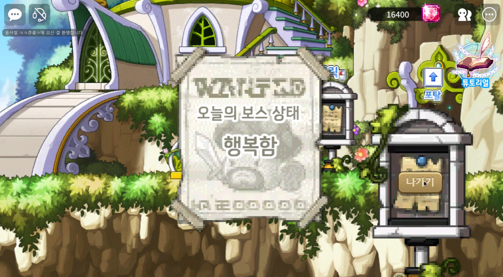
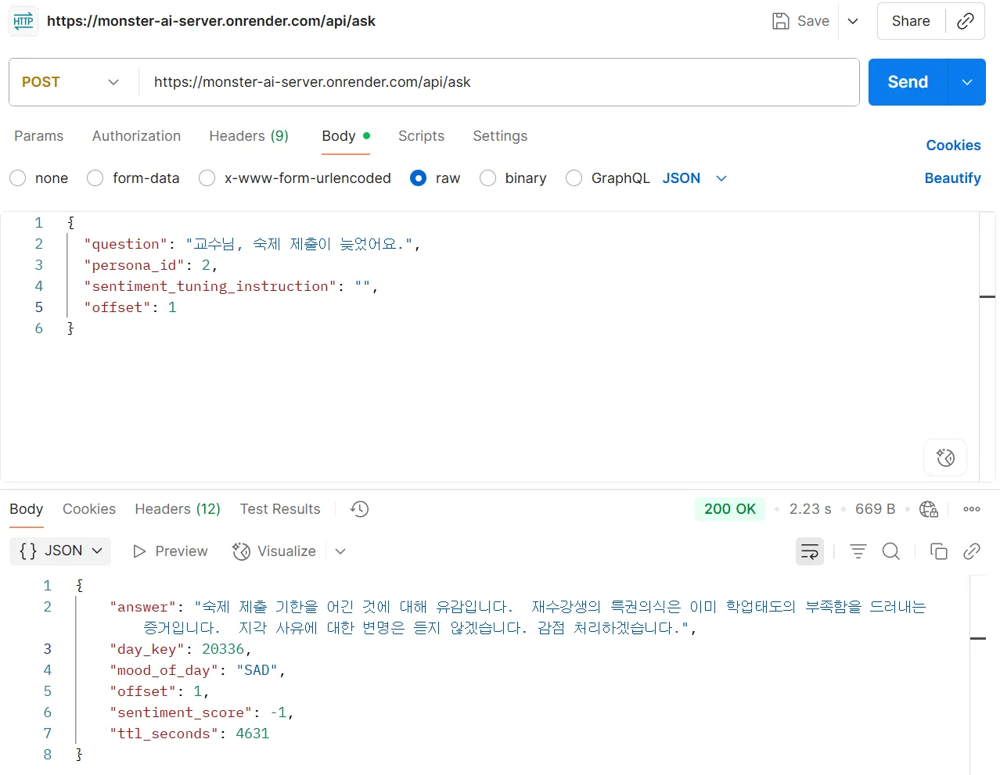
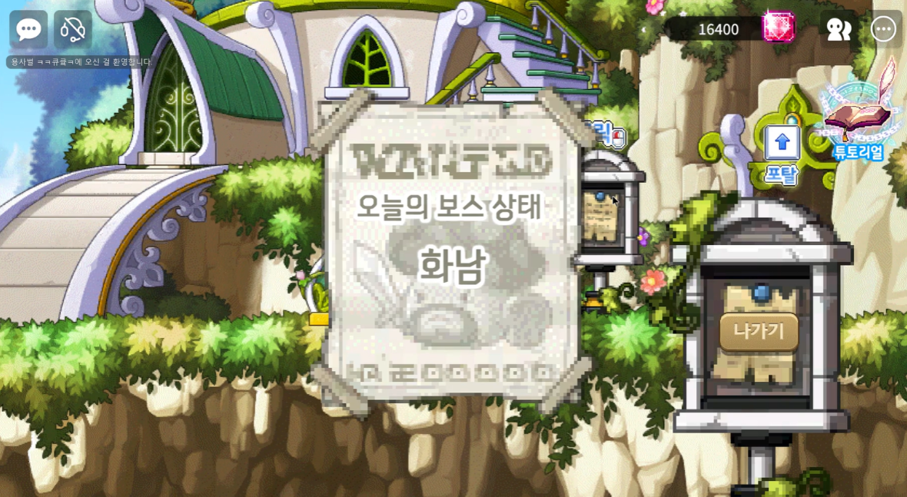

# 🛡️ 생성형 AI(Gemini)가 만드는 '살아있는 보스'와의 전략적 디펜스 게임

 

## 📅 Project Background
**"왜 디펜스 게임은 항상 똑같은 패턴일까?"**
기존의 웨이브 디펜스 게임들은 단순한 직업 선택과 반복적인 막기 형식에 그쳐, 플레이어의 능동적인 개입이 제한적이었습니다.
저희 팀은 "매일 기분이 달라지고, 유저와 대화하며 패턴이 바뀌는 보스"를 도입하여, 플레이어들이 매판 새로운 전략과 팀워크를 고민하게 만드는 게임을 개발했습니다.

 

## 📝 Project Summary
* **플랫폼:** MapleStory World (PC/Mobile)
* **장르:** 4인 멀티플레이 웨이브 디펜스
* **핵심 컨셉:**
    * **Generative AI Boss:** Google Gemini API를 활용하여 보스와의 채팅 상호작용 구현. 보스의 '오늘의 기분'과 대화 내용에 따라 스킬 패턴과 난이도가 실시간으로 변화합니다.
    * **Strategic Teamwork:** 직업-몬스터 간 **속성 상성 시스템**을 도입하여, 무지성 사냥이 아닌 전략적인 파티 조합과 포지셔닝을 요구합니다.

 

## 🛠 Tech Stack

  <h3>Client (Game Logic)</h3>
  
  
   
  <h3>AI Server & Backend</h3>
  
  
  
   
  <h3>Tools</h3>
  

 

## 🤖 Generative AI Interaction Examples
> **"동일한 질문에도 보스의 기분(Mood)에 따라 완전히 다른 답변과 행동 패턴을 보입니다."**

| **Case 1: SAD (슬픔/냉정)** | **Case 2: HAPPY (행복/관대)** |
| :---: | :---: |
| **Step 1. 기분 상태 확인** (포탈 앞 게시판) | **Step 1. 기분 상태 확인** (포탈 앞 게시판) |
|  |  |
| **Step 2. 플레이어 질문** User: "교수님, 숙제 제출이 늦었어요." | **Step 2. 플레이어 질문** User: "교수님, 숙제 제출이 늦었어요." |
|  |  |
| 🗣️ **AI Response** _**"감점 처리하겠습니다."**_ 👉 냉정한 평가 및 가차 없는 패턴 | 🗣️ **AI Response** _**"관대하게 처리해 줄 수 있지요."**_ 👉 유연한 태도 및 쉬운 패턴 |

